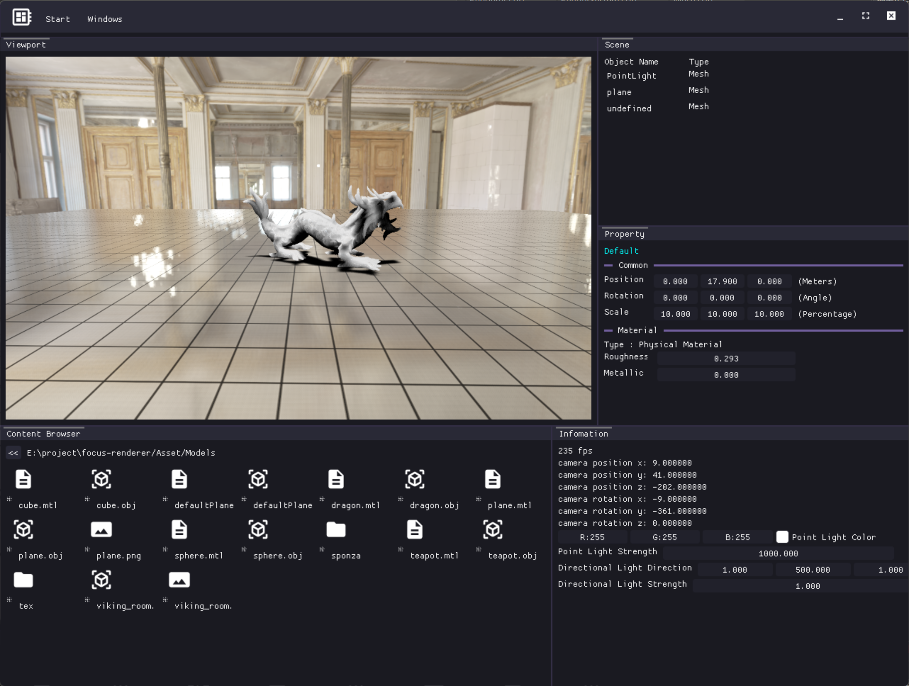
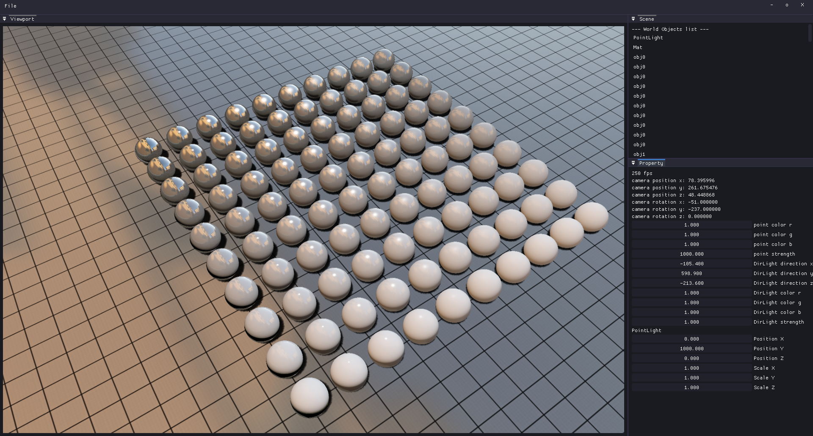

# Realtime Rendering Engine Example

## :fish: Brief
A real-time rendering engine built with [DynamicRHI](https://github.com/chill-pxy/DynamicRHI).  
:fish: Currently supports **Windows** (multi-platform support planned for future releases).  
:fish::fish: **Note:** This is an early development version!

---

## :fish: Features

### :fish: Resources
- Support for `.obj` and `.mlt` model files  
- KTX cubemap textures  
- Image loading via `stb_image`  

### :fish::fish: Shadows
- Shadow Mapping implementation  
- Percentage-Closer Filtering (PCF) for soft shadows  

### :fish: Materials
- Basic Color Material  
- Blinn-Phong Lighting Model  
- Physically Based Rendering (PBR) Material  

### :fish: Scene
- Skybox & Skysphere rendering  
- Basic geometric primitives (cubes, spheres, etc.)  
- Model loader for external assets  
- Dynamic lighting:  
  - Point Lights  
  - Directional Lights  

### :fish::fish: Systems
- Modular Render System  
- Cross-platform Window System  
- Custom RHI (Rendering Hardware Interface) API  
- Material Management System  

---

## :fish: License  
This project is under active development. License details TBD.  